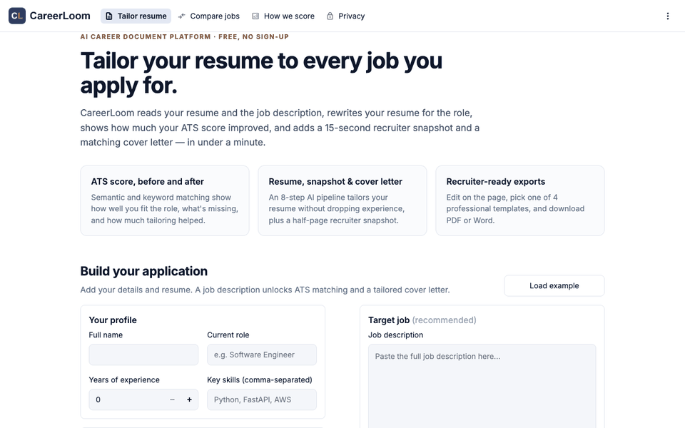
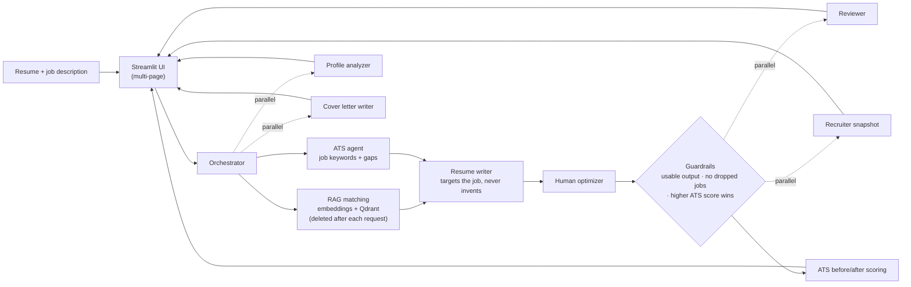

# CareerLoom: AI Multi-Agent Resume Tailoring Platform

[](https://github.com/Madhav1025g/CareerLoom/actions/workflows/tests.yml)

**Live app:** https://careerloom.streamlit.app/

CareerLoom reads your resume and a job description, rewrites your resume for the role (using only experience you
actually have), shows how much your ATS match improved, and adds a 15-second recruiter snapshot, a matching cover
letter, and interview prep.



*Demo with the built-in example resume.*

## Features

**Tailor resume**
- Upload a resume (PDF, DOCX, or TXT) or paste it, plus the job description
- **Job-tailored rewrite** that mirrors the job's terminology and reorders by relevance, never inventing skills or experience
- **ATS score before vs. after**, with job-keyword coverage, "now included" and "still missing" keywords
- **Live re-scoring** as you edit, apply fixes, or click **"I have this"** on a missing skill
- **Recruiter snapshot**: a half-page version a recruiter can scan in 10–15 seconds
- **Cover letter** in three tones (Formal, Friendly, Concise)
- **Interview prep**: 8 likely questions for the job with STAR answers drawn from your resume
- Reviewer suggestions with one-click **Apply**, and in-page editing of every document
- **Four templates** (Professional, Modern, Classic, Compact) for **PDF** and **Word** exports

**Compare jobs**: score one resume against up to three job descriptions, see the best fit first, and tailor for it in one click.

**How we score** and **Privacy** pages explain the scoring formula and exactly what happens to user data.

## Architecture



The 8-step pipeline:

1. **Profile Analyzer**: determines experience level and domain
2. **ATS Match**: extracts the job's key terms and finds the gaps (RAG semantic + keyword matching)
3. **Resume Writer**: rewrites the resume for the job's requirements and wording, never inventing experience
4. **Human Optimizer**: polishes the draft so it reads naturally while keeping every job keyword
5. **Completeness Check**: flags dropped jobs, rejects broken AI output, and keeps the higher-scoring version
6. **Reviewer**: checks grammar, formatting, and consistency, returning applicable fixes
7. **Recruiter Snapshot**: condenses the resume into a 10–15 second, half-page summary
8. **Cover Letter Writer**: drafts a matching cover letter

Interview prep, cover-letter tone rewrites, and job comparison run **on demand**, keeping each generation within the
free Groq tier. When the AI provider's rate limit is reached, users see a friendly "busy, try again later" message.

## How the ATS score works

The job's 10–20 key terms are extracted once, and both the original and tailored resumes are scored against that same
list: **60% keyword coverage** (whole-term matching, so "Java" never matches "JavaScript") + **40% semantic similarity**
to the job description. Changes of ±2 points are shown as "about the same". Details are on the in-app
**How we score** page.

## Privacy

- Resume content is sent to the LLM provider (Groq, or OpenAI as a backup) only to generate results.
- Resume chunks stored in Qdrant for matching are **deleted at the end of every request**.
- Logs contain only request IDs, pipeline steps, and scores: never resume text, prompts, or API keys.
- Anonymous counts only (generations and helpful/not-helpful ratings) via counterapi.dev.

## Tech stack

| Layer | Tools |
|---|---|
| Backend | Python, FastAPI, Pydantic |
| AI / LLM | Groq (primary), OpenAI (fallback), Sentence-Transformers, Qdrant |
| Frontend | Streamlit (multi-page), Altair charts |
| Documents | pypdf, python-docx, fpdf2 |
| Quality | pytest (97 tests), GitHub Actions CI |
| Deployment | Streamlit Community Cloud |

## Project structure

```
streamlit_app.py        # Entry point: navigation, logo, footer
app_pages/
  tailor.py             # Main workflow: inputs, pipeline, results
  compare.py            # Compare jobs
  how_we_score.py       # Scoring explained
  privacy.py            # Data handling
ui_common.py            # Shared styles and helpers
main.py                 # Agents, orchestrator, RAG, scoring, FastAPI endpoint
document_builder.py     # Templates + formatting for preview, PDF, and DOCX
tests/                  # pytest suite (runs offline with a fake LLM)
.github/workflows/      # CI
docs/demo.gif           # README demo
```

## Running locally

```bash
git clone https://github.com/Madhav1025g/CareerLoom.git
cd CareerLoom
python -m venv .venv && source .venv/bin/activate
pip install -r requirements.txt
```

Create a `.env` file (never commit it; it is in `.gitignore`):

```
GROQ_API_KEY=your_groq_key
OPENAI_API_KEY=optional_openai_fallback_key
QDRANT_URL=your_qdrant_cluster_url
QDRANT_API_KEY=your_qdrant_api_key
LLM_PROVIDER=groq
API_KEY_HERE=a_long_random_value   # protects the FastAPI endpoint
```

Run the web app:

```bash
streamlit run streamlit_app.py
```

Or run the REST API (docs at http://127.0.0.1:8000/docs):

```bash
uvicorn main:app --reload
```

## Tests

The suite runs offline with a fake LLM and embedding model (no API keys needed), and runs automatically on every push:

```bash
pip install -r requirements-dev.txt
pytest
```

## Author

Built by Madhav G
